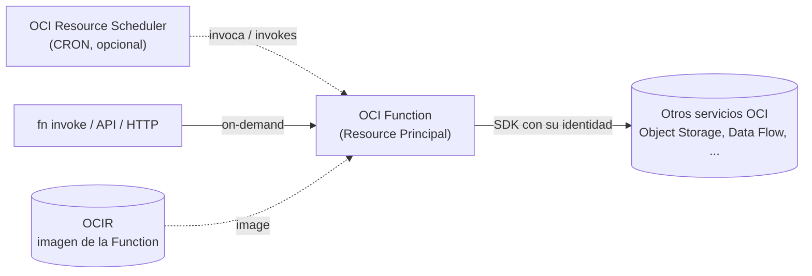

# OCI Functions — Plantilla base / Base Template

> Plantilla mínima y **production-ready** para crear y desplegar una **OCI Function**
> (Python + fdk) con **Terraform**, incluyendo **Resource Principal** (auth sin
> credenciales), **IAM** (dynamic group + policy) y un **Resource Scheduler** (CRON)
> opcional para invocarla automáticamente.
>
> _Minimal, production-ready template to build and deploy an **OCI Function**
> (Python + fdk) with **Terraform**, including **Resource Principal** auth, **IAM**
> (dynamic group + policy) and an optional **Resource Scheduler** (CRON)._

Inspirada en la separación **config + IaC** de las plantillas
[oracle-cloud-dataflow-template](https://github.com/edronald7/oracle-cloud-dataflow-template) y
[oracle-cloud-dataflow-scheduling](https://github.com/edronald7/oracle-cloud-dataflow-scheduling).

---

## Tabla de contenidos / Table of contents

1. [Arquitectura](#1-arquitectura--architecture)
2. [Estructura del repositorio](#2-estructura-del-repositorio--repository-layout)
3. [Prerrequisitos](#3-prerrequisitos--prerequisites)
4. [Configuración central (`function.json`)](#4-configuración-central-functionjson)
5. [Paso 1 — Construir y publicar la imagen](#5-paso-1--construir-y-publicar-la-imagen--build--push-the-image)
6. [Paso 2 — Desplegar con Terraform](#6-paso-2--desplegar-con-terraform--deploy-with-terraform)
7. [Paso 3 — Outputs e invocación](#7-paso-3--outputs-e-invocación--outputs--invoke)
8. [Actualizar el código](#8-actualizar-el-código--update-the-code)
9. [Otorgar permisos a otros servicios](#9-otorgar-permisos-a-otros-servicios--grant-access-to-other-services)
10. [Limpieza](#10-limpieza--cleanup)
11. [Troubleshooting](#11-troubleshooting--errores-comunes)
12. [Checklist](#12-checklist)
13. [Referencias](#13-referencias--references)

---

## 1. Arquitectura / Architecture



La Function se autentica con **Resource Principal** (su propia identidad OCI), por lo
que **no almacena credenciales**. Los permisos hacia otros servicios se otorgan con un
**dynamic group + policy** en `terraform/iam.tf`.

---

## 2. Estructura del repositorio / Repository layout

```
oracle-cloud-functions-template/
├── function.json                 # Config central de la Function (lo más editado)
├── function/                     # Código de la Function (lo que edita el dev)
│   ├── func.py                   # Handler Python (fdk) con Resource Principal
│   ├── func.yaml                 # Metadata Fn (runtime, memoria, timeout)
│   └── requirements.txt          # Dependencias (fdk, oci, ...)
└── terraform/                    # Infraestructura como código (genérico)
    ├── provider.tf               # Provider OCI (>= 6.1.0) y backend
    ├── variables.tf              # Variables de entrada (OCIDs, subnet, imagen)
    ├── locals.tf                 # Parsea function.json
    ├── iam.tf                    # Dynamic group + policy (Function → servicios OCI)
    ├── functions.tf              # Functions Application + Function
    ├── scheduler.tf              # Resource Scheduler CRON (toggle en function.json)
    ├── outputs.tf                # Outputs (IDs, endpoint, comando de invocación)
    └── terraform.tfvars.example  # Plantilla de variables a copiar
```

Para un nuevo proyecto editas, normalmente, **2 archivos**:

1. `function/func.py` — la lógica de negocio.
2. `function.json` — nombre, memoria, timeout, variables de entorno, tags y schedule.

Los permisos extra (si la Function llama a otros servicios) se descomentan en
`terraform/iam.tf`.

---

## 3. Prerrequisitos / Prerequisites

- Cuenta OCI con **Functions** y (opcional) **Resource Scheduler** habilitados.
- Un **VCN + subnet** existente para la Function Application (con salida a internet vía
  NAT o **Service Gateway** para alcanzar los servicios de OCI).
- Permisos para crear **dynamic groups y policies** (normalmente a nivel de tenancy).
- Herramientas locales / local tools:

  | Herramienta | Versión | Uso |
  |-------------|---------|-----|
  | [Terraform](https://developer.hashicorp.com/terraform/install) | >= 1.3 | Desplegar la infraestructura |
  | OCI Provider para Terraform | **>= 6.1.0** | Requerido por el Resource Scheduler |
  | [OCI CLI](https://docs.oracle.com/iaas/Content/API/SDKDocs/cliinstall.htm) | reciente | `~/.oci/config`, perfil `DEFAULT` |
  | [Fn Project CLI](https://fnproject.io/) + Docker | reciente | Construir y publicar la imagen |
  | **Auth Token** de tu usuario OCI | — | `docker login` a OCIR |

> ⚠️ El provider OCI debe ser **>= 6.1.0**: el recurso `oci_resource_scheduler_schedule`
> no existe en versiones anteriores (5.x) y el `terraform apply` fallaría.

---

## 4. Configuración central (`function.json`)

```json
{
  "app_name": "fn-hello",
  "function_name": "fn-hello",
  "memory_in_mbs": 256,
  "timeout_in_seconds": 60,
  "config": { "GREETING": "Hello from OCI Functions" },
  "schedule": { "enabled": false, "cron": "0 6 * * *" },
  "tag": { "ENV": "DEMO", "team": "data-platform" }
}
```

| Campo | Descripción |
|-------|-------------|
| `app_name` | Nombre lógico; la Application se crea como `app-<app_name>`. |
| `function_name` | Nombre de la Function (display name). |
| `memory_in_mbs` | Memoria asignada (128, 256, 512, 1024, 2048). |
| `timeout_in_seconds` | Límite de ejecución (máx. 300). |
| `config` | Variables de entorno inyectadas en la Function (leíbles con `os.environ`). |
| `schedule.enabled` | `true` crea el Resource Scheduler (CRON) y su IAM. |
| `schedule.cron` | Expresión CRON en **UTC** (p.ej. `0 6 * * *` = 06:00 UTC). |
| `tag` | Freeform tags aplicados a todos los recursos. |

> `func.yaml` debe mantener `name`, `memory` y `timeout` coherentes con `function.json`
> (el `fn build` usa `func.yaml`; Terraform usa `function.json`).

---

## 5. Paso 1 — Construir y publicar la imagen / Build & push the image

La imagen debe existir en **OCIR antes** del `terraform apply` (Terraform crea la
Function apuntando a esa imagen; no la construye).

```bash
# 1) Login a OCIR (usa tu Auth Token como password)
docker login <region-key>.ocir.io -u '<namespace>/<usuario>'

# 2) Configura el contexto de Fn
fn create context oci-fn --provider oracle
fn use context oci-fn
fn update context oracle.compartment-id <compartment_ocid>
fn update context api-url https://functions.<region>.oci.oraclecloud.com
fn update context registry <region-key>.ocir.io/<namespace>/<repo>

# 3) Construir y publicar SOLO la imagen
cd function
fn build
fn push
```

La imagen publicada será algo como
`iad.ocir.io/<namespace>/<repo>/fn-hello:0.0.1`
→ cópiala en `function_image` dentro de `terraform.tfvars`.

> `<region-key>` es el prefijo de OCIR (p.ej. `iad` para us-ashburn-1, `phx` para us-phoenix-1).

---

## 6. Paso 2 — Desplegar con Terraform / Deploy with Terraform

```bash
cd terraform
cp terraform.tfvars.example terraform.tfvars
# edita terraform.tfvars: OCIDs, región, subnet y function_image

terraform init
terraform plan
terraform apply
```

Terraform crea, de forma declarativa:

- La **Functions Application** (`app-<app_name>`) y la **Function** (apuntando a la imagen).
- El **dynamic group** de la Function + una **policy** (con un permiso base y ejemplos comentados).
- Si `schedule.enabled = true`: el **Resource Schedule** (CRON) y su IAM de invocación.

---

## 7. Paso 3 — Outputs e invocación / Outputs & invoke

Tras el `apply`, revisa los outputs:

```bash
terraform output
```

| Output | Descripción |
|--------|-------------|
| `function_application_id` | OCID de la Functions Application. |
| `function_id` | OCID de la Function. |
| `function_invoke_endpoint` | Endpoint de invocación de la Function. |
| `function_image` | Imagen OCIR desplegada. |
| `fn_dynamic_group` | Dynamic group (Resource Principal) de la Function. |
| `schedule_id` | OCID del Resource Schedule (`null` si `schedule.enabled = false`). |
| `invoke_command` | Comando `fn invoke` listo para copiar/pegar. |

Invoca la Function:

```bash
echo -n '{"name":"OCI"}' | fn invoke app-fn-hello fn-hello

# Respuesta esperada:
# {"message": "Hello from OCI Functions, OCI!"}
```

Si habilitaste el schedule, verifícalo en la consola:
*Governance & Administration → Resource Scheduler → Schedules* (estado + próxima ejecución).

---

## 8. Actualizar el código / Update the code

Cuando cambies `func.py`, `requirements.txt` o `func.yaml`:

```bash
# 1) Sube una nueva versión de la imagen (incrementa version en func.yaml)
cd function && fn build && fn push

# 2) Actualiza function_image en terraform.tfvars y aplica
cd ../terraform && terraform apply
```

---

## 9. Otorgar permisos a otros servicios / Grant access to other services

La Function ya tiene identidad (Resource Principal). Para que pueda llamar a otros
servicios, descomenta/edita las sentencias en `terraform/iam.tf`, por ejemplo:

```hcl
"ALLOW DYNAMIC-GROUP ${oci_identity_dynamic_group.fn_dg.name} TO MANAGE objects IN COMPARTMENT ${var.compartment_name} WHERE target.bucket.name='my-bucket'",
```

y en `func.py` usa el signer:

```python
signer = oci.auth.signers.get_resource_principals_signer()
client = oci.object_storage.ObjectStorageClient(config={}, signer=signer)
```

---

## 10. Limpieza / Cleanup

```bash
cd terraform
terraform destroy
```

> Elimina la Application, la Function, el schedule y el IAM gestionados por Terraform.
> La imagen en OCIR **no** se borra (gestiónala aparte si lo necesitas).

---

## 11. Troubleshooting / Errores comunes

| Síntoma | Causa probable | Solución |
|---------|----------------|----------|
| `does not support resource type "oci_resource_scheduler_schedule"` | Provider OCI 5.x | Usa provider **>= 6.1.0** (ver `provider.tf`) y `terraform init -upgrade`. |
| `Policy must have at least one statement` | Comentaste todas las sentencias de IAM con `schedule.enabled = false` | Conserva la sentencia base de `iam.tf` (`READ objectstorage-namespaces`). |
| `unauthorized` / `denied` en `docker login` o `fn push` | Password incorrecta | Usa un **Auth Token** (no la contraseña de consola). Usuario: `<namespace>/<usuario>`; federados: `<namespace>/oracleidentitycloudservice/<usuario>`. |
| `image not found` al hacer `apply` | La imagen no está en OCIR o el tag no coincide | Ejecuta `fn build && fn push` antes y copia el URI completo (con tag) en `function_image`. |
| El schedule no invoca la Function | Faltan policies `USE fn-function` / `fn-invocation` | Se crean solas cuando `schedule.enabled = true`; revisa que el `apply` las haya creado. |
| La Function no alcanza otros servicios OCI | Subnet sin salida | La subnet necesita **NAT** o **Service Gateway**; el permiso correcto en `iam.tf`. |
| Timeout al invocar | `timeout_in_seconds` bajo | Súbelo en `function.json` (máx. 300) y vuelve a aplicar. |

---

## 12. Checklist

- [ ] Compartimiento, VCN/subnet y servicios habilitados (Functions, Scheduler si aplica).
- [ ] `function.json` configurado (nombre, memoria, config, schedule, tags).
- [ ] Imagen construida y publicada en OCIR (`fn build && fn push`).
- [ ] `terraform.tfvars` completado (incl. `function_image` y `function_subnet_id`).
- [ ] Provider OCI **>= 6.1.0** (`terraform init -upgrade` si vienes de 5.x).
- [ ] `terraform apply` sin errores; outputs revisados.
- [ ] Invocación de prueba OK; (si aplica) schedule verificado y logs activos.

---

## 13. Referencias / References

- [OCI Functions (Docs)](https://docs.oracle.com/iaas/Content/Functions/home.htm)
- [Fn Project](https://fnproject.io/)
- [Scheduling OCI Functions (Docs)](https://docs.oracle.com/iaas/Content/Functions/Tasks/functionsschedulingfunctions-about.htm)
- [Resource Principal en Functions (Docs)](https://docs.oracle.com/iaas/Content/Functions/Tasks/functionsaccessingociresources.htm)
- [Terraform OCI Provider](https://registry.terraform.io/providers/oracle/oci/latest/docs)
